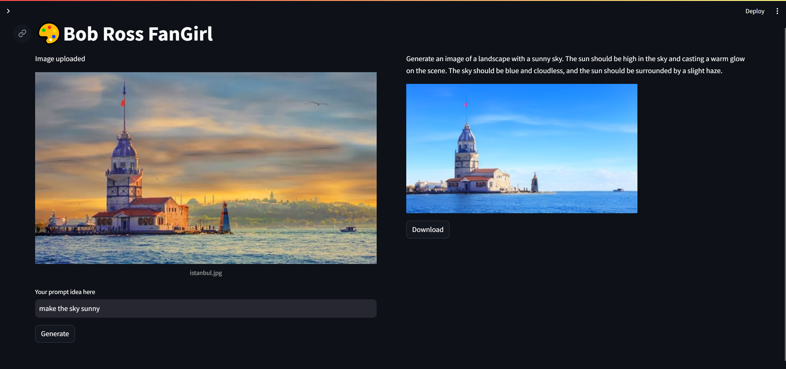
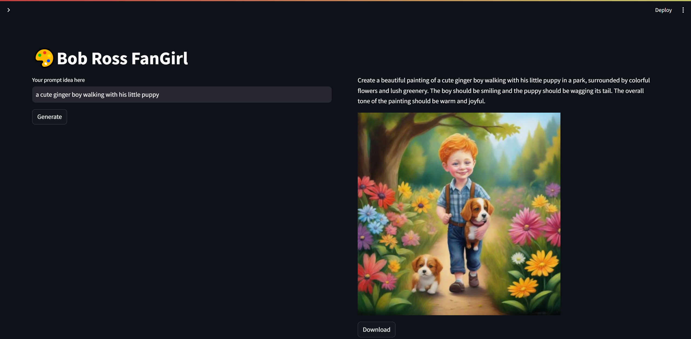

# Gemini-to-Image
## Overview
It is a versatile tool that leverages Google's LLM Gemini, along with HuggingFace models, to generate text and images based on user prompts. It utilizes Langchain for text generation and Hugging Face models for image generation.
The project consists of a Streamlit GUI interface where users can interact with the generated content. Users can upload their own images and provide prompts to generate customized images and text outputs.
Check [imgs](https://github.com/g-hano/Gemini-to-Image/tree/main/imgs) folder for usage video.



## Features
- Accepts user prompts via text input.
- Utilizes Google's Gemini via Langchain to generate enhanced prompts based on user input.
- Generates images based on user prompts.
- Allows users to upload their own images and provides prompts to generate customized images and text outputs.

## Requirements
- Dependencies listed in `requirements.txt`

## Installation
1. Clone the repository:
```
git clone https://github.com/g-hano/Gemini-to-Image.git
```
2. Navigate to the project directory:
```
cd Gemini-to-Image
```
3. Install dependencies:
```
pip install -r requirements.txt
```

## Usage
1. Run the Streamlit app:
```
streamlit run app.py
```
2. Access the Streamlit interface in your web browser.

## Screenshots


## Acknowledgements
- [Google Gemini](https://gemini.google.com/app)
- Hugging Face Models
  - [Text-to-Image](https://huggingface.co/stabilityai/stable-diffusion-xl-base-1.0)
  - [Image-to-Image](https://huggingface.co/timbrooks/instruct-pix2pix)
- [Streamlit](https://docs.streamlit.io/)

## License
MIT
